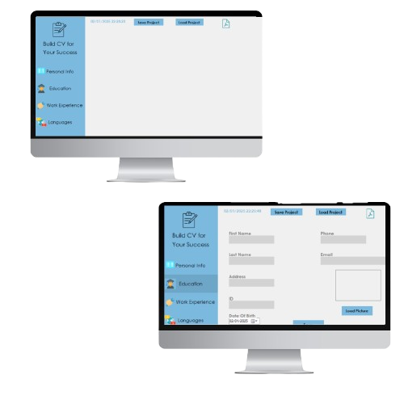
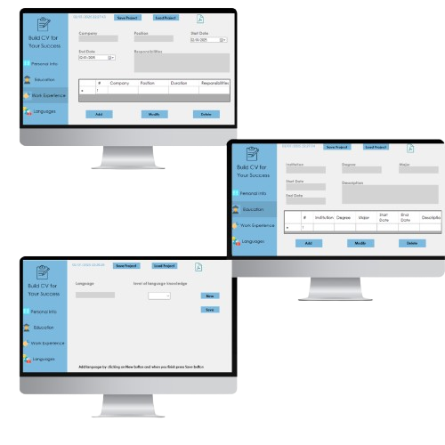

📝 CreateCV_Project 
Welcome to CreateCV_Project!

This is a comprehensive C# application designed to help users build professional resumes effortlessly. 
The app features an intuitive graphical user interface (GUI) and provides tools to input, validate, and organize resume sections. 

With customizable design options and a polished PDF export, CreateCV_Project is perfect for job seekers who want to make a great first impression. 

🌟 Features 
 👤 Personal Details: 
Easily input your name, contact information, and a professional summary.
The app validates required fields to ensure your resume is complete.

 🎓 Education Section: 
Add multiple education entries, including institution name, degree, field of study, and graduation year.
Customize the order of entries for a polished look.

 💼 Work Experience: 
Detail your professional journey by adding job titles, company names, responsibilities, and employment dates.
Highlight your achievements with bullet points.

 🌐 Language Skills: 
Showcase your linguistic abilities by listing languages and proficiency levels.
Perfect for multilingual job seekers.

 🎨 Customizable Design: 
Personalize your resume with custom colors, fonts, and layouts.
Choose between modern and classic templates to suit your preferences.

 📄 PDF Export: 
Generate a high-quality PDF output of your resume.
The app ensures the final product is professional, formatted, and ready for sharing.

 🖥️ User-Friendly Interface: 
Navigate through sections effortlessly with a clean and intuitive design.
Built-in validations ensure error-free input.

 🌍 Multi-language Support: 
The app supports multiple languages, making it accessible to a diverse audience. 

 🛠 Tools and Technologies
 💻 Programming Language: C#
 🎨 UI Design: Windows Forms (WinForms)
 📦 PDF Generation: iTextSharp
 🛠️ Development Environment: Visual Studio 

🧑‍💼 How It Works 
1️⃣ Input Data: 
Users can fill in their details across various sections like personal information, education, work experience, and skills.
Fields are validated to avoid errors or omissions. 

2️⃣ Customize Layout: 
Choose from a variety of resume templates and personalize them with your preferred colors and fonts.
The app provides a live preview of changes. 

3️⃣ Generate PDF: 
Once all sections are complete, export your resume to a polished PDF format.
The app ensures consistent alignment and styling for a professional look. 

4️⃣ Review and Share: 
Open the PDF to review your resume and share it directly via email or print it for physical distribution. 

📸 Screenshots 
 
 
 📝 CreateCV_Project   is your all-in-one solution to crafting the perfect resume. 
With its user-friendly interface, customizable options, and polished output,  this app simplifies the resume creation process for everyone, from students to seasoned professionals. 🚀 
